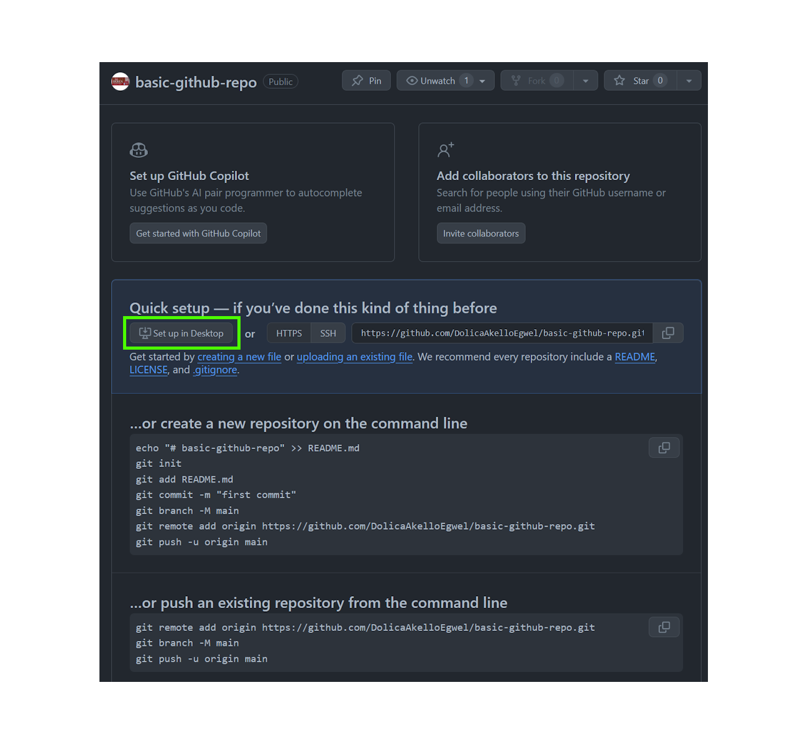
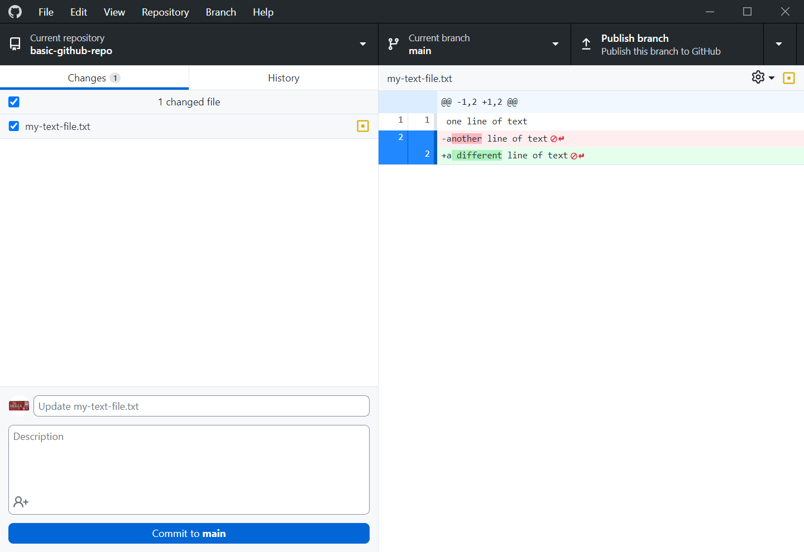

# Introduction to GitHub and Version Control

---
# Why Use Version Control?

- A better kind of backup
- Review history of your changes
- Restore older code versions
- Undo mistakes
- Nothing commited to version control can be lost _unless you make it happen_
- Saves you emailing files back and forth if you are working with others
- Different people can make changes to the same code

<!-- Even if you're the only one doing the coding, there are still benefits to using Version Control. -->

---

...Or to save yourself from this.

---
# What is Git and GitHub?

Git: Version control tool to manage code history. Runs on the command line.
GitHub: Hosting service for Git repositories.
GitHub Desktop: Like Git but has a GUI.

---
# Sign In

---
# Creating a Repo

* Go to GitHub.com and make sure you're logged in
* Click on the green button that says New
* Give the repo a name and a description
* Click on Create Repository

---
# Configure GitHub Desktop

Now that we've created a repo we can use GitHub Desktop to open it.

1. Click "Set up in Desktop"
2. Choose a local path for the repo
3. Click "Clone"

Now to take a look at the folder we can go to the top menu and click Repository > Show in Finder / Explorer.

---
# Creating a Text File

Now let's create a simple text file and add two lines of text to it. This will cause a change to appear in GitHub Desktop.

If you're on Mac you can use `touch` to create an empty file.

---

---
# Commiting Files

1. Tick the checkbox next to the file you want to include in the next commit. This _stages_ the file.
2. Give a commit message. This should describe the changes that you have made to the file(s). You can also provide an optional description.
3. Click the blue Commit button. This will now create a new "snapshot" of our repository.

---
# History

Take a look at the History tab. You can now see the commit with its message. The right hand pane will show us what was changed in this commit.

---
# Changing / Removing Lines

Now change the _second_ line of your file and see what happens in the GitHub Desktop changes tab.

---

---
# Resetting a Change

- You might change a file, then realise that this isn't actually a change you wanted.
- If you haven't commited yet then you can correct this by resetting the file.
- In GitHub Desktop this is done by right clicking the file in the Changes tab and clicking on "Discard changes..."
- This will take the file back to the state it was in in the most recent commit.

---
# Amending Commits

- Sometimes we make a slight typo in our commit messages or realise it's missing something that it ought to say.
- In this case, you'd _amend_ your commit.
- In GitHub Desktop this is done by right clicking the commit in the History tab and then changing your commit message.
- Ideally you want to do this _before_ pushing the code. (I will talk about pushing code in a bit...)

---
# So how often to commit?

- When it _feels right_...
- When you've done a 10-15 minute "chunk" of work.
- When you have something that may doesn't fully solve the problem you're working on, but is a "complete" step towards solving that problem.

Smaller commits make it easier to isolate problems.

---
# Handling Changes in Multiple Files

- Sometimes multiple files have changes. This can be seen when you use the `git status` command, or by looking at the Changes menu in GitHub Desktop.
- Git allows us to choose which files will be in a single commit. This allows us to keep things more organised.

---
# .gitignore

- A .gitignore file let's Git know that you don't want a certain file to be tracked with version control.
- In GitHub Desktop we can right click a file and add it to .gitignore.
- It will no longer appear in the changes tab unless it's removed from .gitignore again.
- The .gitingore file is also something you will want to track with version control.

---
# Overview

If you understand this, then you understand Git.

---
# Exercise: Merge Conflicts

- This will be a group exercise.

---

# Extra: Cool Git Stuff

---
# The magic of `bisect`

`git bisect` is a handy command that can be a life-saver.

---
# Extra Extra: `pre-commit`

- `pre-commit` is a tool that ensures certain checks on your file pass before a commit is accepted.
- This could be a linting tool 

---
#  `lazygit`

- A terminal UI for using Git.
- Nice if you think using a mouse takes time...

---
# Keeping track of documents with Git

