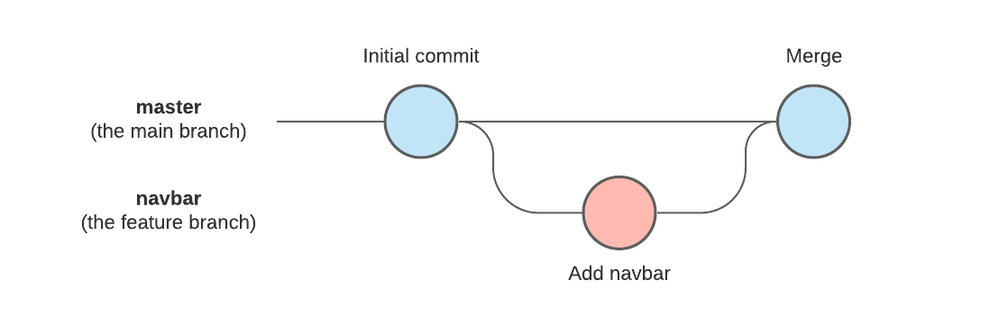

# Introduction to GitHub and Version Control

---

<!-- Another advantage of Git is saving yourself from things like this... -->

---
# Why Use Version Control?

- Review history of your changes.
- Restore older code versions, like an unlimited undo.
- Saves you emailing files back and forth if you are working with others.
- Different people can make changes to the same code in parallel.

<!-- Even if you're the only one doing the coding, there are still benefits to using Version Control. -->

---
# What is Git and GitHub?

**Git**: Version control tool to manage code history. Runs on the command line.
**GitHub**: Hosting service for Git repositories.
**GitHub Desktop**: A GUI for using Git commands.

<!-- There are alternatives to Git and there are alternatives to GitHub. -->

---

---
# Creating a GitHub Account

1. Go to github.com and click on "Sign up" in the top-right.
2. Follow the instructions to create an account.
3. Verify your email adddress with GitHub.
4. Configure 2FA.

---
# Creating a Repo

1. Open GitHub Desktop.
2. In the top-menu go to File and then click "New repository...".
3. Give the repository a name and a description.
4. Set a local path for the repository.

<!-- A demo goes here. -->

---
# Creating a Text File

Now let's create a simple text file and add two lines of text to it. This will cause a change to appear in GitHub Desktop.

1. On the top-level menu go to Repository > Show in Explorer / Finder.
2. Create a text file in this folder and add two lines of random text to it.

If you're on Mac you can use `touch a-text-file` to create an empty file. Then `echo "blahblahblah" >> a-text-file` should add something to the file. Do that a second time and you'll have a file with two lines of text in it.

---

# Changes Tab

The Changes tab shows us what has changed in our files since the most recent commit.

<!-- 

Now you can see that a change in our working directory has been detected in GitHub Desktop. 

-->

---
# Staging and Commiting Files

Once we've made some changes that we want to record, we can make a _commit_.

1. Tick the checkbox next to the file you want to include in the next commit. This _stages_ the file.
2. Give the commit a message. This should describe the changes that you have made to the file(s). You can also provide an optional description.
3. Click the blue Commit button. This will now create a new "snapshot" of our repository.

---
# History

<!--  -->

Take a look at the History tab. You can now see your commit with its message. The right hand pane will show us what was changed in this commit.

---
# Changing / Removing Lines

Now change the _first_ line of your text file and see what happens in the Changes tab.

<!-- Give people a moment to do this before going to the next slide. -->

<!-- Now we can see that a red line has appeared to indicate that something was removed, while a green line indicates that something was added. -->

---
# Resetting a Change

- You might change a file, then realise that this isn't actually a change you wanted.
- If you haven't commited yet then you can correct this by resetting the file.
- In GitHub Desktop this is done by right clicking the file in the Changes tab and clicking on "Discard changes..."
- This will take the file back to the state it was in in the most recent commit.

---
# Amending Commits

- Sometimes we make a slight typo in our commit messages or realise it's missing something that it ought to say.
- In this case, you'd _amend_ your commit.
- In GitHub Desktop this is done by right clicking the commit in the History tab and then changing your commit message.
- Ideally you want to do this _before_ pushing the code to GitHub. (I will talk about pushing code in a bit...)

---
# So how often to commit?

- When it _feels right_...
- When you've done a 10-15 minute "chunk" of work.
- When you have something that may doesn't fully solve the problem you're working on, but is at least a "complete" step towards solving that problem.

Smaller commits make it easier to isolate problems.

<!-- It's hard to define what exactly that point is, but it will make sense with more experience. -->

---
# Publishing a Repo

- Publishing allows us to have a copy of the repo on GitHub.
- You can hit the publish button to do this.
- Now take a look at your GitHub profile and see the repository that's been added.

<!-- Demo goes here. -->

---
# Cloning

- Make a local copy of a remote repository.
- Transfer code you've written from one machine to another.
- Retrieve code from someone else that's available on GitHub.

---
# .gitignore

- A .gitignore file lets Git know that you don't want a certain file to be tracked with version control.
- In GitHub Desktop we can right click a file and add it to .gitignore.
- It will no longer appear in the Changes tab unless it's removed from .gitignore.
- The .gitingore file is also something you will want to track with version control.
---
# Branching

- Allows you to create an "offshoot" of your repository.
- Keep the working code "safe" while you attempt to add a new feature to it.

<!-- Demo if time allows -->

---
# Overview

* You make a change to a file and _stage_ it in GitHub Desktop.
* You then _commit_ the changes, which creates a snapshot of your repository.
* You can then _push_ these changes to GitHub so that the code is on your GitHub account.
* By using _branches_ you can manage multiple different versions of your code.
* With _cloning_ to you get code made by others from GitHub and use it too.
<!-- ---
# Overview

If you understand this, then you pretty much understand Git :) -->

---
# Finding Code on GitHub

- Topics: hhttps://github.com/topics/machine-learning
- Searching by language: https://github.com/search?q=generative+language%3AProcessing&type=repositories&l=Processing

<!-- Topics + users can be followed, which will then bring things up in your feed. -->
<!-- GitHub then suggests things to you that it thinks might be up your alley. -->
<!-- Search "generative" and select the language processing -->

---

# Extra: Cool Git Stuff

---
#  `lazygit`

- A terminal UI for using Git.
- Nice if you're a touch-typer.
- Other alternatives to GitHub Desktop: GitKraken, `gitui`, 

---
# The magic of `bisect`

`git bisect` is actually overpowered...

https://www.youtube.com/watch?v=P3ZR_s3NFvM

---
# Keeping code tidy with `pre-commit`

- `pre-commit` is a tool that ensures certain checks on your file pass before a commit is accepted.
- This could be a linting tool. 

---
# Keeping track of documents with Git

LaTeX is comfy.

---

---

Slides: [bit.ly/3MPYIWu](https://bit.ly/3MPYIWu)
Creative Technology Lab: [github.com/creativetechnologylab](https://github.com/creativetechnologylab)

